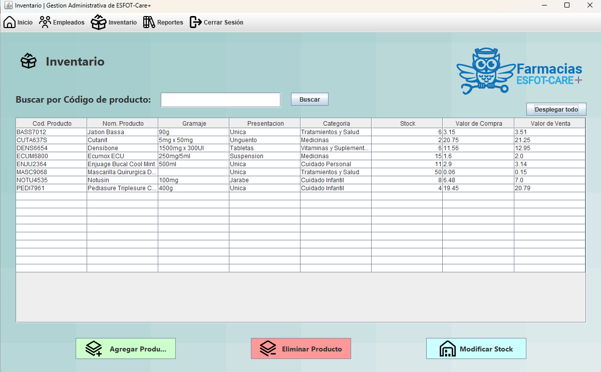

<h1 align="center">
     
  
Sistema de Gestión Farmacéutica - ESOFT-Care+

</h1>
**Este proyecto ha sido realizado con el proposito de demostrar las habilidades aprendidas en el lenguaje Java, el diseño de interfaces y el manejo de bases de datos relacionales.**

# Contenido
1. Integrantes
2. Antecedentes  
3. Desarrollo
4. Funcionalidad
5. Conclusiones
6. Anexos

## Integrantes
- Eduardo Almachi 
- Bryan Delgado
- Brittany Espinel
- Melany Sangucho
- David Vallejo
  
## Antecendetes del Proyecto
Este proyecto se fundamente en crear un sistema de farmacia que permita gestionar tanto administradores como cajero. En el apartado de cajeros se debe realizar las ventas de productos y generación de facturas, asi mismo imprimir estas mismas en PDF.
Por el lado de administrador se debe ver la lista de empleados, de productos y reportes. Estas listas serán modificables en sus productos (agregar, eliminar y modificar); asi mismo, se podrán descargar los reportes en formato PDF. 

Todo este proyecto deberá ser ligado a una base de datos relacional, en este caso, MySQL. 

Todo el proyecto se realizó mediante el IDE Netbeans, las librería de AbsoluteLayout y móudlos modificables para generar PDFs.

- ### Requisitos del sistema
  - JDK version: 20.0 o posterior
  - Versión de MySQL: 8.0
    - Usuario DB: root
    - Password DB: root2023
## Desarrollo
- Login del sistema  
  
- ### Administrador
    - Home de administrador con notificaciones de alerta
      
    - Listado de empleados
      
        - Agregar Empleados
          
        - Eliminar empleados
          
    - Listado de Productos en inventario
      
        - Agregar producto
          
        - Eliminar producto
          
        - Modificar Stock de cualquier producto
          
    - Reportes de ventas
      
        - Generación de reportes en PDF de ventas por cada cajero
          
- ### Cajero
    - Pantalla principal del cajero
      
    - Realización de venta
      
      - No se pueden repetir productos  
        
      - Pago efectivo presenta ventana para devolucion de dinero  
        
    - Aprobación de pago y generación de factura en PDF  
      
      
## Funcionalidades
Este proyecto permite generar un sistema para una farmacia que posee un CRUD como elemento base, en un sistema Vista-Controlador. Este mismo permite realizar las accione spor cajero y administrador, de la siguiente clasificación de actividades:
- ### Administrador
  - Verificar la fluidez y acceder al sistema por su apartado correspondiente.
  - Agregar y eliminar usuarios de tipo cajero.
  - Agregar, mdificar y eliminar productos al inventario del sistema. Estos mismos será presentados en una tabla general.
  - Gnerar un reporte de ventas por cada cajero, realizando una sumatoria total de venta de cada uno de estos.
  - Generar y guardar un archivo PDF con los reportes.
- ### Cajero
  - Ingreso de datos de cliente para facturación.
  - Selección de productos e ingreso de cantidades necesarias para la compra.
  - Realización de venta y selección de métodos de pago.
    - El pago con efectivo genera una operación, en el cual se ingresa el valor entregado (entero) y se devuelve el valor de devolución monetaria al cliente.
    - El pago con tarjeta es visual, se genera de manera automática.
  - Generación de factura de cliente en formato PDF.
## Conclusiones
- Complejidad de la Regulación Farmacéutica: El sector farmacéutico está altamente regulado en la mayoría de los países. Concluir que se necesita un profundo conocimiento de las regulaciones locales y nacionales para asegurarse de que el sistema cumpla con todos los requisitos legales, como el registro y seguimiento de productos, la gestión de recetas médicas y la privacidad de los datos de los pacientes.

- Interfaz de Usuario Amigable: Una de las conclusiones clave es que la interfaz de usuario debe ser intuitiva y fácil de usar para el personal de la farmacia. Esto implica la necesidad de diseñar una interfaz amigable que permita a los empleados realizar tareas como la gestión de inventario, la atención al cliente y la venta de productos de manera eficiente.

- Gestión de Inventarios y Caducidades: La gestión de inventarios en una farmacia es crítica para garantizar la disponibilidad de medicamentos y productos. El sistema debe ser capaz de llevar un registro en tiempo real de los niveles de inventario y alertar sobre productos próximos a vencer o caducados, lo que requiere una base de datos eficiente y un seguimiento constante.

- Seguridad y Privacidad de Datos: Otra conclusión importante es que se debe garantizar la seguridad y privacidad de los datos de los pacientes y la información financiera. Esto implica implementar medidas de seguridad robustas, como la encriptación de datos y el acceso controlado al sistema, para proteger la información sensible.

- Integración con Sistemas Externos: En el contexto de la atención médica, es común que una farmacia deba interactuar con otros sistemas, como sistemas de seguros médicos o sistemas de atención médica electrónica (EHR). Concluir que es esencial la capacidad de integración de su sistema de gestión y venta con otros sistemas para facilitar la facturación, el procesamiento de reclamos y la coordinación de la atención médica.

## Anexos
- ### Documentación
  - [Actividades del Proyecto](https://www.notion.so/Esquemas-y-Resultados-67fe02e9a2784f1087546e5faff61e94)
  - [Archivos Externos](https://www.notion.so/Archivos-externos-7e8bd1359d49442dba2ce7f4342e7669)
  - [Link del video explicativo]()
